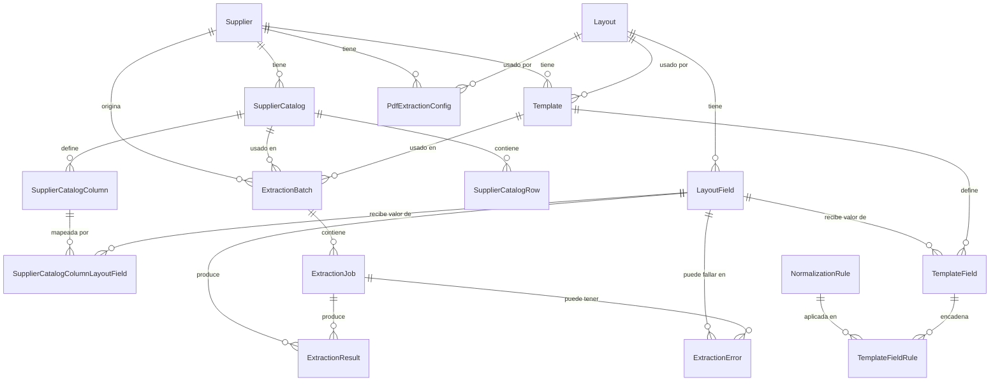

# Modelo de datos

Este documento describe el modelo de datos del sistema de conversión de facturas (**Conversor Optimizado**). El sistema está dividido en cuatro apps de Django, cada una con una responsabilidad distinta:

| App | Responsabilidad |
|---|---|
| `layouts` | Define los **layouts de salida** (Casa Azul, Casa Rojo, ...) y sus campos, además del catálogo de reglas de normalización disponibles. |
| `catalogs` | Administra los **proveedores** y sus **catálogos de referencia** (fracciones, descripciones, etc.) usados para completar datos que no vienen en la factura. |
| `templates` | Define **cómo extraer** datos de un archivo de un proveedor (XML/XLSX/PDF) y cómo mapearlos a un layout, incluyendo la cadena de normalización aplicada a cada campo. |
| `extraction` | Registra la **ejecución** del proceso de extracción: lotes, trabajos por fila, resultados y errores. |

## Principio de diseño: config vs. data

A lo largo del sistema se repite un mismo patrón:

- **Config** (`NormalizationRule.config`, `PdfExtractionConfig.base_prompt`/`hints`): reglas que se definen una vez y se reutilizan.
- **Data** (`SupplierCatalogRow.data`, `ExtractionResult`): valores concretos generados en tiempo de ejecución.

Este patrón evita duplicar lógica de negocio en cada fila de datos y mantiene la configuración auditable y editable de forma centralizada.

## Diagrama de relaciones

!!! note "Todos los modelos heredan de `BaseModel`"
    Salvo `SupplierCatalogColumnLayoutField`, que hereda directo de `models.Model`. `BaseModel` aporta los campos de auditoría estándar (creación, actualización, soft-delete/`is_active`, etc.) usados en todo el proyecto.

---

## App `layouts`

Define el destino final de la extracción: qué layouts existen, qué campos tiene cada uno y qué reglas de normalización están disponibles para transformarlos.

### `Layout`

Un layout de salida (por ejemplo, *Casa Azul*, *Casa Rojo*).

| Campo | Tipo | Notas |
|---|---|---|
| `code` | `CharField(32)` | Único. Identificador corto del layout. |
| `name` | `CharField(255)` | Nombre legible. |

**Orden por defecto:** `code`.

### `LayoutField`

Campo de destino dentro de un layout específico (`supplier_code`, `invoice_date`, etc.).

| Campo | Tipo | Notas |
|---|---|---|
| `layout` | FK → `Layout` | `on_delete=CASCADE`, `related_name="fields"`. |
| `name` | `CharField(64)` | Nombre del campo. |
| `sort_order` | `PositiveIntegerField` | Orden de aparición en el layout de salida. |

**Restricciones:**

- `unique_field_name_per_layout`: `(layout, name)` único.
- `unique_sort_order_per_layout`: `(layout, sort_order)` único.

Un `LayoutField` está **siempre acotado a un `Layout`**, incluso si el mismo nombre lógico de campo existe en varios layouts — esto permite que cada layout tenga su propio orden y sus propias reglas sin acoplar layouts entre sí.

### `NormalizationRule`

Catálogo reutilizable de reglas de transformación de valores.

| Campo | Tipo | Notas |
|---|---|---|
| `name` | `CharField(128)` | Único. |
| `description` | `CharField(255)` | Opcional. |
| `rule_type` | `CharField(32)` con `choices` | `date_format`, `value_map`, `regex_replace`, `trim`, `uppercase`. |
| `config` | `JSONField` | Configuración específica del tipo de regla (ver abajo). |

**Orden por defecto:** `name`.

!!! warning "Forma esperada de `config`"
    `config` debe contener **únicamente** el diccionario de configuración interno de la regla (por ejemplo, para `value_map`: `{"SUZ": "SUZUKI", ...}`), **no** el payload completo de la regla. Guardar el objeto completo de `NormalizationRule` dentro de `config` produce fallas silenciosas de normalización, ya que el código de extracción espera acceder directamente a las claves de mapeo.

    | `rule_type` | Forma esperada de `config` |
    |---|---|
    | `value_map` | `{"valor_origen": "valor_destino", ...}` |
    | `date_format` | `{"input_format": "...", "output_format": "..."}` |
    | `regex_replace` | `{"pattern": "...", "replacement": "..."}` |
    | `trim` / `uppercase` | `{}` (no requiere configuración) |

Las reglas no se aplican directamente a un `LayoutField`: se encadenan a un `TemplateField` a través de `TemplateFieldRule` (ver app `templates`), lo que permite que el mismo `LayoutField` reciba distinto tratamiento de normalización según el proveedor/template de origen.

---

## App `catalogs`

Administra proveedores y sus catálogos de referencia, usados para completar en el layout de salida datos que no vienen en la factura original (por ejemplo, la fracción arancelaria a partir del número de parte).

### `Supplier`

| Campo | Tipo | Notas |
|---|---|---|
| `code` | `CharField(32)` | Único. |
| `name` | `CharField(255)` | |

**Orden por defecto:** `code`.

### `Currency`

Catálogo de formatos de moneda usados por la casa.

| Campo | Tipo | Notas |
|---|---|---|
| `code` | `CharField(8)` | Único. |
| `country` | `CharField(64)` | |

### `Umc`

Catálogo de unidades de medida (*Unit of Measure Code*).

| Campo | Tipo | Notas |
|---|---|---|
| `code` | `CharField(16)` | Único. |
| `description` | `CharField(255)` | |

### `SupplierCatalog`

Un catálogo de referencia provisto por un proveedor (fracciones, descripciones, etc.). Un proveedor puede tener más de un catálogo.

| Campo | Tipo | Notas |
|---|---|---|
| `supplier` | FK → `Supplier` | `on_delete=CASCADE`, `related_name="catalogs"`. |
| `name` | `CharField(255)` | p. ej. *"Catálogo de Fracciones Suzuki"*. |
| `pivot_field_name` | `CharField(64)` | Nombre de la columna del archivo del catálogo usada como llave de búsqueda (p. ej. `'PART'`). |

**Orden por defecto:** `(supplier, name)`.

### `SupplierCatalogColumn`

Describe una columna de un `SupplierCatalog` y, opcionalmente, a qué `LayoutField` alimenta.

| Campo | Tipo | Notas |
|---|---|---|
| `supplier_catalog` | FK → `SupplierCatalog` | `on_delete=CASCADE`, `related_name="columns"`. |
| `source_name` | `CharField(128)` | Nombre de la columna tal como aparece en el archivo de catálogo. |

**Restricciones:** `unique_column_per_catalog`: `(supplier_catalog, source_name)` único.

### `SupplierCatalogRow`

Una fila del catálogo de un proveedor. **Se reemplaza por completo** en cada actualización (no hay upsert parcial).

| Campo | Tipo | Notas |
|---|---|---|
| `supplier_catalog` | FK → `SupplierCatalog` | `on_delete=CASCADE`, `related_name="rows"`. |
| `pivot_value` | `CharField(128)` | Valor de la llave de búsqueda (p. ej. el número de parte). |
| `data` | `JSONField` | `source_name -> valor crudo`, según las `SupplierCatalogColumn` definidas. |

**Restricciones e índices:**

- `unique_pivot_value_per_catalog`: `(supplier_catalog, pivot_value)` único.
- Índice compuesto en `(supplier_catalog, pivot_value)` para acelerar el lookup en tiempo de extracción.

### `SupplierCatalogColumnLayoutField`

Mapea una columna de catálogo a un `LayoutField`, **por layout**.

| Campo | Tipo | Notas |
|---|---|---|
| `column` | FK → `SupplierCatalogColumn` | `on_delete=CASCADE`, `related_name="layout_fields"`. |
| `layout_field` | FK → `layouts.LayoutField` | `on_delete=PROTECT`. |

**Restricciones:** `unique_layout_field_per_column`: `(column, layout_field)` único.

**Validación (`clean`)**: una misma columna no puede mapearse dos veces a `LayoutField`s distintos que pertenezcan al **mismo** layout (sí puede mapearse una vez por cada layout distinto).

!!! info "Por qué existe este modelo intermedio"
    Un catálogo se reutiliza entre todos los layouts que lo necesiten (Casa Azul, Casa Roja, ...), pero cada layout tiene sus propios `LayoutField`. Una columna de catálogo por sí sola no puede apuntar a un único FK fijo de `LayoutField`; necesita una relación por layout. Esto también cubre la columna pivote: también requiere su propio mapeo, para que el código de extracción sepa contra qué `LayoutField` extraído debe comparar `SupplierCatalogRow.pivot_value` en el layout que se esté procesando.

---

## App `templates`

Define cómo se extrae información de un archivo de un proveedor y cómo se mapea hacia un `Layout`, incluyendo la cadena de normalización de cada campo.

### `Template`

Plantilla de un proveedor para extracción XML/XLSX, que mapea hacia un `Layout` destino.

| Campo | Tipo | Notas |
|---|---|---|
| `supplier` | FK → `catalogs.Supplier` | `on_delete=CASCADE`, `related_name="templates"`. |
| `layout` | FK → `layouts.Layout` | `on_delete=PROTECT`, `related_name="templates"`. |
| `name` | `CharField(255)` | |
| `document_type` | `CharField(8)` con `choices` | `xml` / `xlsx`. |

**Restricciones:** `unique_active_template_per_supplier_layout_format` — único `(supplier, layout, document_type)` entre las plantillas con `is_active=True`. Esto permite tener plantillas inactivas/históricas sin violar la unicidad.

**Orden por defecto:** `(supplier, layout, name)`.

### `TemplateField`

Define qué campo origen se extrae y a qué `LayoutField` se mapea.

| Campo | Tipo | Notas |
|---|---|---|
| `template` | FK → `Template` | `on_delete=CASCADE`, `related_name="fields"`. |
| `layout_field` | FK → `layouts.LayoutField` | `on_delete=PROTECT`, `related_name="template_fields"`. |
| `source_field` | `CharField(255)` | Nombre de columna o expresión XPath, según `extraction_type`. |
| `extraction_type` | `CharField(16)` con `choices` | `header_name` / `xpath`. |
| `worksheet` | `CharField(128)` | Solo aplica a XLSX. |
| `header_occurrence` | `PositiveIntegerField` | Default `1`. Si el encabezado se repite en el Excel, indica qué ocurrencia corresponde a este campo (1 = primera columna con ese nombre, 2 = segunda, etc.). |

**Restricciones:**

- `unique_layout_field_per_template`: `(template, layout_field)` único — un `LayoutField` solo puede llenarse una vez por template.
- `unique_source_field_occurrence_per_template`: `(template, source_field, header_occurrence)` único.

**Validación (`clean`)**: el `layout_field` debe pertenecer al mismo `layout` que el `template`.

### `TemplateFieldRule`

Encadena reglas de normalización a un `TemplateField`, en orden de ejecución.

| Campo | Tipo | Notas |
|---|---|---|
| `template_field` | FK → `TemplateField` | `on_delete=CASCADE`, `related_name="rules"`. |
| `normalization_rule` | FK → `layouts.NormalizationRule` | `on_delete=PROTECT`, `related_name="template_fields"`. |
| `sort_order` | `PositiveIntegerField` | Orden de ejecución cuando hay varias reglas encadenadas. |

**Restricciones:** `unique_rule_per_template_field`: `(template_field, normalization_rule)` único.

**Orden por defecto:** `(template_field, sort_order)` — es este orden el que determina la secuencia en que se aplican las reglas sobre el valor crudo extraído.

### `PdfExtractionConfig`

Configuración de prompt para extracción vía LLM en PDFs con texto extraíble (no escaneados/imagen).

| Campo | Tipo | Notas |
|---|---|---|
| `supplier` | FK → `catalogs.Supplier` | `on_delete=CASCADE`, `related_name="pdf_extraction_configs"`. |
| `layout` | FK → `layouts.Layout` | `on_delete=PROTECT`, `related_name="pdf_extraction_configs"`. |
| `base_prompt` | `TextField` | Prompt base de extracción. |
| `hints` | `TextField` | Opcional. Instrucciones específicas del proveedor (moneda, ubicación de campos, etc.). |
| `is_active` | `BooleanField` | Default `True`. |
| `created_at` | `DateTimeField` | `auto_now_add=True`. |

**Orden por defecto:** `(supplier, -created_at)`.

---

## App `extraction`

Registra la ejecución del proceso de extracción sobre un archivo subido: el lote, cada fila procesada como trabajo individual, los valores extraídos/normalizados y los errores encontrados.

### `ExtractionBatch`

Representa un proceso de extracción completo a partir de un archivo subido. Un batch puede contener múltiples `ExtractionJob` (por ejemplo, un Excel de 500 filas genera 1 `ExtractionBatch` y 500 `ExtractionJob`).

| Campo | Tipo | Notas |
|---|---|---|
| `supplier` | FK → `catalogs.Supplier` | `on_delete=PROTECT`, `related_name="extraction_batches"`. |
| `source_file` | `CharField(512)` | Ruta/nombre del archivo origen. |
| `file_format` | `CharField(8)` con `choices` | `xml` / `xlsx` / `pdf`. |
| `status` | `CharField(16)` con `choices` | `pending` / `processed` / `error` / `review`. Default `pending`. |
| `template` | FK → `templates.Template` | Opcional. `on_delete=PROTECT`. |
| `pdf_extraction_config` | FK → `templates.PdfExtractionConfig` | Opcional. `on_delete=PROTECT`. |
| `supplier_catalog` | FK → `catalogs.SupplierCatalog` | Opcional. `on_delete=PROTECT`. |
| `total_records` | `PositiveIntegerField` | Default `0`. |
| `successful_records` | `PositiveIntegerField` | Default `0`. |
| `failed_records` | `PositiveIntegerField` | Default `0`. |
| `processed_at` | `DateTimeField` | Opcional. |

**Índices:** `(status, created_at)`.

**Orden por defecto:** `-created_at`.

!!! note "`template` vs. `pdf_extraction_config`"
    Son mutuamente relacionados con el `file_format`: XML/XLSX usan `template`, PDF usa `pdf_extraction_config`. Ambos campos son opcionales a nivel de base de datos; la app debe garantizar en su lógica que se llene el que corresponda según `file_format`.

### `ExtractionJob`

Representa un registro individual procesado dentro de un `ExtractionBatch` (una fila).

| Campo | Tipo | Notas |
|---|---|---|
| `extraction_batch` | FK → `ExtractionBatch` | `on_delete=CASCADE`, `related_name="jobs"`. |
| `row_number` | `PositiveIntegerField` | |
| `status` | `CharField(16)` con `choices` | `pending` / `processed` / `error` / `review`. Default `pending`. |
| `processed_at` | `DateTimeField` | Opcional. |

**Restricciones:** `unique_row_per_extraction_batch`: `(extraction_batch, row_number)` único.

**Orden por defecto:** `row_number`.

### `ExtractionResult`

Valor extraído y normalizado para un `LayoutField`, dentro de un `ExtractionJob` individual.

| Campo | Tipo | Notas |
|---|---|---|
| `extraction_job` | FK → `ExtractionJob` | `on_delete=CASCADE`, `related_name="results"`. |
| `layout_field` | FK → `layouts.LayoutField` | `on_delete=PROTECT`, `related_name="extraction_results"`. |
| `raw_value` | `TextField` | Valor tal cual fue extraído. |
| `normalized_value` | `TextField` | Valor después de aplicar la cadena de `NormalizationRule`. |

**Restricciones:** `unique_layout_field_per_job`: `(extraction_job, layout_field)` único.

**Orden por defecto:** `(extraction_job, layout_field__sort_order)`.

### `ExtractionError`

Error asociado a un `ExtractionJob` individual.

| Campo | Tipo | Notas |
|---|---|---|
| `extraction_job` | FK → `ExtractionJob` | `on_delete=CASCADE`, `related_name="errors"`. |
| `field_name` | `CharField(255)` | Opcional. Usado cuando el error no está atado a un `LayoutField` concreto. |
| `layout_field` | FK → `layouts.LayoutField` | Opcional. `on_delete=SET_NULL`, `related_name="extraction_errors"`. |
| `message` | `TextField` | Descripción del error. |

**Orden por defecto:** `-created_at`.

---

## Flujo de extracción de extremo a extremo

1. Se sube un archivo de un `Supplier` → se crea un `ExtractionBatch` con su `file_format`.
2. Según el formato, el batch se asocia a un `Template` (XML/XLSX) o a un `PdfExtractionConfig` (PDF), y opcionalmente a un `SupplierCatalog` si se requieren datos de referencia.
3. Por cada fila/registro del archivo se crea un `ExtractionJob`.
4. Para cada `TemplateField` del `Template`, se extrae el `raw_value` del archivo origen y se le aplica, en orden (`sort_order`), la cadena de `TemplateFieldRule` → `NormalizationRule`, generando el `normalized_value`.
5. El resultado por campo se guarda como `ExtractionResult`, ligado al `LayoutField` correspondiente.
6. Si un campo tiene datos que solo existen en el catálogo del proveedor (no en el archivo), se resuelven vía `SupplierCatalogColumnLayoutField`: se busca el `SupplierCatalogRow` cuyo `pivot_value` coincide con el valor ya extraído del campo pivote, y se toma el valor correspondiente desde `SupplierCatalogRow.data`.
7. Cualquier falla en los pasos 4–6 se registra como `ExtractionError`, ligado al `ExtractionJob` y, cuando aplica, al `LayoutField` afectado.
8. Al terminar, el `ExtractionBatch` actualiza `total_records`, `successful_records`, `failed_records`, `status` y `processed_at`.
