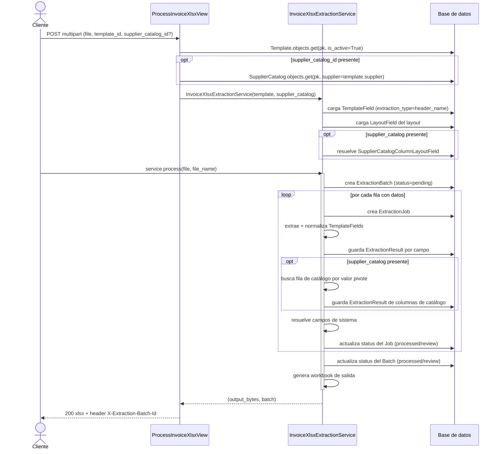

# Flujo de extracción: XLSX

Este documento describe la implementación concreta del flujo de extracción para facturas en formato **XLSX**, correspondiente a `extraction/services.py` (`InvoiceXlsxExtractionService`) y su endpoint `ProcessInvoiceXlsxView`.

Para el modelo de datos subyacente (`ExtractionBatch`, `ExtractionJob`, `TemplateField`, `NormalizationRule`, etc.) ver [`data-model.md`](data-model.md).

## Resumen del flujo



## `InvoiceXlsxExtractionService`

### Inicialización

`InvoiceXlsxExtractionService(template, supplier_catalog=None)` valida y precarga todo lo que se reutiliza fila a fila, para no repetir queries dentro del loop de procesamiento:

| Se valida / precarga | Detalle |
|---|---|
| `template.document_type == XLSX` | Si no, lanza `ExtractionProcessingError`. |
| `template_fields` | Solo `TemplateField` con `extraction_type=HEADER_NAME` (la extracción XLSX no soporta `xpath`). Si no hay ninguno, lanza `ExtractionProcessingError`. |
| `layout_fields` | Todos los `LayoutField` del layout del template, ordenados por `sort_order` — define las columnas del Excel de salida. |
| `_catalog_mappings` | Solo si se pasa `supplier_catalog`: los `SupplierCatalogColumnLayoutField` de ese catálogo para el layout del template (ver [`_resolve_catalog_mappings`](#resolucion-de-datos-de-catalogo)). |

!!! warning "Errores de configuración vs. errores de datos"
    `ExtractionProcessingError` se reserva para errores de **configuración** que impiden arrancar el proceso completo (template mal tipado, sin campos configurados, sin filas en el Excel). Los errores de una fila individual (no encontró la fila del catálogo, valor pivote vacío, etc.) **no** detienen el batch: se registran como `ExtractionError` y esa fila queda en `REVIEW`.

### Lectura de encabezados y soporte de columnas duplicadas

`_load_headers()` lee la fila 1 de la **primera hoja** del workbook y construye `{nombre_de_encabezado: [índices_de_columna]}`, permitiendo que un mismo nombre de encabezado aparezca más de una vez.

`_iter_data_rows()` recorre las filas desde la 2 en adelante y, para cada `TemplateField`, selecciona la columna correcta usando `TemplateField.header_occurrence`:

```python
occurrence_idx = (tf.header_occurrence or 1) - 1
col_idx = occurrences[occurrence_idx]  # si existe
```

- `header_occurrence=1` → primera columna con ese nombre de encabezado.
- `header_occurrence=2` → segunda columna con ese mismo nombre.

Una fila se considera vacía (`all_blank`) y se **omite** si ninguno de los `TemplateField` configurados tiene valor en esa fila; de lo contrario, se produce como `(row_idx, raw_values_by_tf_id)`.

### Normalización

`apply_normalization_chain(template_field, raw_value)` aplica, en orden (`TemplateFieldRule.sort_order`), cada `NormalizationRule` encadenada al `TemplateField`. Si `raw_value` es `None` o `""`, la cadena completa se omite y se devuelve el valor tal cual (las reglas no se ejecutan sobre valores vacíos).

`apply_normalization_rule(rule, value)` implementa cada `rule_type`:

| `rule_type` | Comportamiento |
|---|---|
| `trim` | `value.strip()`. |
| `uppercase` | `value.strip().upper()`. |
| `regex_replace` | `re.sub(config["pattern"], config["replacement"], value)`. Si no hay `pattern` configurado, devuelve `value` sin tocar. |
| `date_format` | Reparsea `value` con `config["input_format"]` y lo reformatea con `config["output_format"]` (`datetime.strptime` / `strftime`). Si falta alguno de los dos formatos, o el parseo falla (`ValueError`), devuelve `value` sin tocar — **falla silenciosa intencional**, no se registra `ExtractionError`. |
| `value_map` | Ver detalle abajo. |

#### `value_map` extendido

A diferencia de un mapeo plano simple, `_apply_value_map` soporta una forma extendida de `config`:

```json
{
  "map": {"DLS": "USA"},
  "case_insensitive": true,
  "default": null,
  "lookup": {
    "app_label": "catalogs",
    "model": "Currency",
    "match_field": "country",
    "result_field": "code"
  }
}
```

Orden de resolución:

1. Se busca `value` (normalizado a mayúsculas si `case_insensitive` es `true`, que es el default) dentro de `map`.
2. Si no está en `map`, se usa `config.get("default", value)` — **importante**: si no hay `default` explícito, el valor original pasa sin transformar en vez de quedar vacío o marcarse como error.
3. Si además hay `lookup` configurado, el resultado del paso anterior (`mapped_value`) se usa como filtro (`match_field`) contra el modelo indicado (`app_label`/`model`, resuelto dinámicamente vía `django.apps.apps.get_model`), y se devuelve `result_field` de ese objeto en vez de `mapped_value`.


### Resolución de datos de catálogo

Cuando se pasa un `supplier_catalog`, cada fila pasa por `_fill_from_catalog(job)`:

1. Se busca, dentro de `_catalog_mappings`, el mapping cuyo `column.source_name == supplier_catalog.pivot_field_name` — es decir, el `LayoutField` que contiene el valor pivote ya extraído del Excel.
   - Si no existe ese mapping → `ExtractionError` ("No se encontró un LayoutField asociado al campo pivote...") y la fila queda incompleta.
2. Se lee el `ExtractionResult` de ese `LayoutField` para el job actual, usando `normalized_value` (o `raw_value` si el normalizado está vacío) como valor pivote.
   - Si el valor pivote resulta vacío → `ExtractionError`.
3. Se busca `SupplierCatalogRow` con `pivot_value` igual al valor pivote extraído.
   - Si no hay match → `ExtractionError` con el nombre del catálogo y el valor buscado.
4. Si se encontró la fila, se recorren todos los `_catalog_mappings` **excepto** el del campo pivote, y por cada uno se lee `catalog_row.data.get(mapping.column.source_name)` y se guarda como `ExtractionResult` (mismo valor en `raw_value` y `normalized_value` — **el catálogo no pasa por la cadena de normalización de `TemplateFieldRule`**, esa cadena solo aplica a campos extraídos directamente del Excel).

Cualquiera de los tres primeros casos marca el job como incompleto (`had_errors=True`) y, al terminar `_process_row`, el `ExtractionJob.status` queda en `REVIEW` en vez de `PROCESSED`.

!!! note "El campo pivote no requiere ser columna de catálogo"
    `pivot_field_name` en `SupplierCatalog` solo identifica qué campo del **Excel/layout** sirve para buscar la fila; no necesita tener una `SupplierCatalogColumn` propia ni un mapping en `SupplierCatalogColumnLayoutField` para *extraerse* del catálogo — de hecho, el paso 4 lo excluye explícitamente. El mapping del pivote solo se usa para saber **de qué `LayoutField`** leer el valor de búsqueda.

### Campos de sistema

`_fill_system_fields` resuelve campos calculados fuera de la extracción normal, mapeando por **nombre exacto** de `LayoutField` contra `SYSTEM_FIELD_HANDLERS`:

```python
SYSTEM_FIELD_HANDLERS = {
    "CLAVE DEL PROVEEDOR": lambda job, row_data: job.extraction_batch.supplier.code,
}
```

Si el `Layout` tiene un `LayoutField` cuyo `name` coincide con una clave de este diccionario, su valor se llena automáticamente con el resultado del handler (en este caso, el `code` del `Supplier` del batch), sin depender de ningún `TemplateField`. Para agregar un nuevo campo de sistema, basta con agregar una entrada a `SYSTEM_FIELD_HANDLERS` con el nombre exacto del `LayoutField` destino.

### Generación del Excel de salida

`_build_output_workbook(jobs)` genera un único workbook con:

- Una hoja cuyo título es `layout.code` (truncado a 31 caracteres, límite de Excel para nombres de hoja).
- Encabezados: los `name` de todos los `layout_fields`, en `sort_order`.
- Una fila por `ExtractionJob`, tomando de cada `ExtractionResult` el `normalized_value` (o `raw_value` si el normalizado está vacío); si un `LayoutField` no tiene `ExtractionResult` para ese job, la celda queda vacía.

### Estados resultantes

| Nivel | Condición | Status |
|---|---|---|
| `ExtractionJob` | Todos los campos y (si aplica) el catálogo se resolvieron sin error | `PROCESSED` |
| `ExtractionJob` | Al menos un error registrado en `_fill_from_catalog` | `REVIEW` |
| `ExtractionBatch` | Ningún `ExtractionJob` en `REVIEW` | `PROCESSED` |
| `ExtractionBatch` | Al menos un `ExtractionJob` en `REVIEW` | `REVIEW` |

`ExtractionBatch` nunca queda en `ERROR` como resultado de `process()` — ese status solo tiene sentido si el proceso completo falla antes de terminar (no cubierto por este servicio, que solo lanza `ExtractionProcessingError` *antes* de crear el batch).

---

## Endpoint: `ProcessInvoiceXlsxView`

`POST` — sube un Excel de factura y regresa el Excel ya transformado al layout de destino.

### Request

`multipart/form-data`

| Campo | Tipo | Requerido | Descripción |
|---|---|---|---|
| `file` | archivo | Sí | Excel de la factura a procesar. |
| `template_id` | integer | Sí | PK de un `Template` con `document_type=xlsx` y `is_active=True`. |
| `supplier_catalog_id` | integer | No | PK de un `SupplierCatalog` perteneciente al **mismo proveedor** que el template (`supplier_catalog.supplier == template.supplier`), usado para completar datos por valor pivote. |

Validación de payload vía `ProcessInvoiceXlsxSerializer` (`serializer.is_valid(raise_exception=True)`) antes de tocar la base de datos.

### Respuestas

| Caso | Status | Cuerpo |
|---|---|---|
| Éxito | `200 OK` | Archivo `.xlsx` binario (`Content-Type: application/vnd.openxmlformats-officedocument.spreadsheetml.sheet`), como adjunto (`Content-Disposition: attachment; filename="<LAYOUT_CODE>_extraccion.xlsx"`). |
| `template_id` no existe o no está activo | `404 Not Found` | Estándar de `get_object_or_404`. |
| `supplier_catalog_id` no existe o no pertenece al proveedor del template | `404 Not Found` | Estándar de `get_object_or_404`. |
| Error de configuración (`ExtractionProcessingError`) | `400 Bad Request` | `{"detail": "<mensaje>"}` |

En toda respuesta `200`, además se incluye el header custom:

```
X-Extraction-Batch-Id: <id del ExtractionBatch creado>
```

Esto permite al cliente consultar después el detalle del batch (jobs, resultados, errores por fila) sin tener que parsear el Excel de salida.

!!! note "Un `200` no garantiza cero errores de fila"
    El endpoint responde `200` con el Excel generado incluso si algunas filas quedaron en `REVIEW` por errores de catálogo — el archivo de salida siempre se genera con lo que sí se pudo resolver, dejando vacías las celdas sin dato. Para saber si el batch tuvo filas con problemas, el cliente debe consultar el batch (`X-Extraction-Batch-Id`) y revisar `status`/`failed_records`, no basta con el código HTTP.

### Ejemplo de request

```bash
curl -X POST https://api.example.com/extraction/process-invoice-xlsx/ \
  -H "Authorization: Bearer <token>" \
  -F "file=@factura_suzuki.xlsx" \
  -F "template_id=4" \
  -F "supplier_catalog_id=2"
```