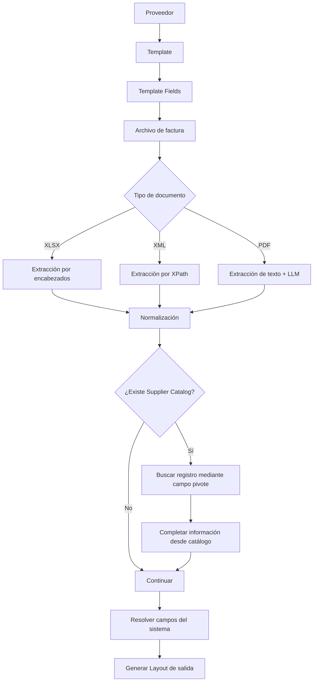
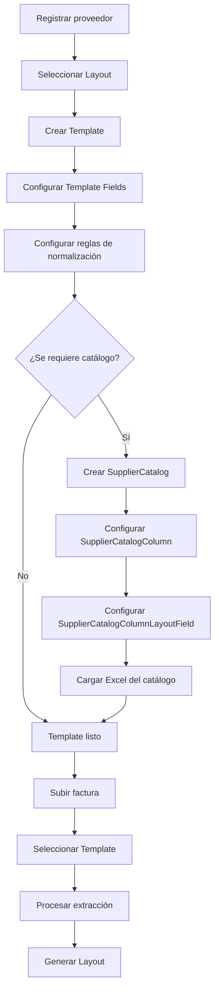

# Visión general de la arquitectura

## Propósito del sistema

El sistema tiene como objetivo automatizar la conversión de facturas de proveedores hacia un formato estructurado requerido por CASA, manteniendo la posibilidad de soportar otros formatos de salida en el futuro.

El sistema reemplaza un proceso anteriormente basado en archivos Excel y lógica específica para cada proveedor. En el proceso anterior, los usuarios trabajaban con archivos Excel utilizados como plantillas, realizaban modificaciones manuales y mantenían catálogos de gran tamaño directamente en archivos Excel. Esto hacía que el proceso fuera difícil de mantener, poco escalable y propenso a errores.

La solución actual centraliza en un sistema configurable la extracción, normalización y enriquecimiento de la información contenida en las facturas.

El objetivo principal es que la lógica de procesamiento no dependa de un archivo específico ni requiera implementar código nuevo para cada proveedor. En su lugar, la configuración del proveedor, el formato de su factura, el layout de salida y las reglas de transformación se administran mediante entidades configurables.

---

## Flujo general

El proceso principal sigue el siguiente flujo:



---

## Componentes principales

El sistema está dividido en cuatro aplicaciones principales:

* `catalogs`
* `layouts`
* `templates`
* `extraction`

Cada aplicación tiene una responsabilidad específica dentro del flujo de procesamiento.

### `layouts`

Define la estructura de los archivos de salida.

Un `Layout` representa un formato de salida y contiene una colección ordenada de `LayoutField`.

Cada `LayoutField` representa una columna del archivo final y tiene un `sort_order` que determina la posición de la columna en el Excel generado.

Actualmente existen dos layouts principales:

* `Casa Azul`
* `Casa Rojo`

Estos layouts se crean mediante una migración de datos (`seed`) y se consideran parte de la configuración base del sistema.

Los layouts no se modifican automáticamente durante el procesamiento de facturas. Si se requiere modificar su estructura o agregar nuevos campos, debe realizarse un cambio explícito en la configuración correspondiente y aplicar una nueva migración o modificación de la migración de datos.

Aunque el sistema está diseñado para trabajar con layouts adicionales, los layouts de CASA son actualmente los formatos principales de salida.

---

### `catalogs`

Administra información de referencia utilizada durante el proceso de extracción.

Incluye catálogos generales como:

* Proveedores (`Supplier`)
* Monedas (`Currency`)
* Unidades de medida (`Umc`)

La información de proveedores, monedas y unidades de medida proviene principalmente de un sistema externo denominado CASA. Se contempla que estos datos sean sincronizados periódicamente desde una base de datos para mantener la información actualizada.

Aunque el sistema permite administrar estos registros manualmente, la intención es que la fuente principal de información sea la sincronización con CASA.

También administra los catálogos específicos de cada proveedor mediante:

* `SupplierCatalog`
* `SupplierCatalogColumn`
* `SupplierCatalogRow`
* `SupplierCatalogColumnLayoutField`

Estos catálogos permiten almacenar en la base de datos información que anteriormente se mantenía en archivos Excel de gran tamaño.

Los catálogos de proveedor pueden utilizarse para dos objetivos principales:

1. **Completar información que no viene directamente en la factura.**
2. **Obtener información de referencia para normalizar o validar valores extraídos de la factura.**

El acceso a un catálogo se realiza mediante un campo pivote (`pivot_field_name`). Este campo permite relacionar un valor extraído desde la factura con una fila específica del catálogo.

Por ejemplo, si la factura contiene un número de parte, este valor puede utilizarse como pivote para localizar una fila dentro del catálogo del proveedor y obtener información adicional como una fracción arancelaria, descripción u otros campos requeridos por el layout.

Los catálogos se cargan desde archivos Excel una vez que se han configurado previamente sus columnas (`SupplierCatalogColumn`) y las relaciones entre esas columnas y los campos del layout (`SupplierCatalogColumnLayoutField`).

Durante la carga del catálogo, la información se transforma de un archivo Excel a registros almacenados en la base de datos.

El sistema también dispone de un endpoint específico para eliminar duplicados de un archivo Excel de catálogo utilizando el campo pivote configurado para ese catálogo. Esta funcionalidad pertenece exclusivamente al proceso de preparación y administración de catálogos.

---

### `templates`

Define cómo se debe interpretar la información de una factura de un proveedor.

Un `Template` relaciona:

* Un proveedor.
* Un layout de salida.
* Un tipo de documento.

Actualmente se soportan:

* `XLSX`
* `XML`

Un proveedor puede tener diferentes templates dependiendo del layout y del tipo de documento que utilice.

Por ejemplo, un template puede indicar que una factura XLSX de un determinado proveedor debe procesarse utilizando el layout `Casa Rojo`.

Los `TemplateField` definen la relación entre la información de origen y el layout de salida.

Cada campo especifica:

* A qué template pertenece.
* Qué `LayoutField` debe recibir el resultado.
* Qué campo debe buscarse en el archivo de origen.
* Qué tipo de extracción debe realizarse.
* Qué hoja utilizar en el caso de archivos XLSX.
* Qué ocurrencia utilizar cuando un encabezado aparece varias veces.

Para archivos XLSX, la extracción se realiza actualmente utilizando el nombre de los encabezados.

Para archivos XML, el campo de origen se define mediante XPath.

Los `TemplateFieldRule` permiten asociar reglas de normalización a un campo y ejecutarlas en un orden determinado.

Las reglas pueden utilizarse para transformar la información extraída antes de almacenarla como resultado final.

---

### `extraction`

Es responsable de ejecutar el procesamiento de las facturas.

El flujo principal para archivos XLSX consiste en:

1. Recibir el archivo de factura.
2. Recibir el template que debe utilizarse.
3. Recibir opcionalmente un catálogo del proveedor.
4. Leer las filas del archivo de origen.
5. Crear un `ExtractionBatch` para representar el procesamiento completo.
6. Crear un `ExtractionJob` por cada registro o fila procesada.
7. Extraer los valores definidos en los `TemplateField`.
8. Aplicar las reglas de normalización configuradas.
9. Guardar los resultados como `ExtractionResult`.
10. Consultar el catálogo del proveedor cuando corresponda.
11. Completar los campos del layout utilizando la información obtenida del catálogo.
12. Resolver campos calculados o generados por el sistema.
13. Registrar errores individuales mediante `ExtractionError`.
14. Generar el archivo Excel final utilizando la estructura definida por el `Layout`.

El resultado final contiene las columnas definidas por el layout seleccionado y una fila por cada registro procesado.

---

## Flujo de configuración

Antes de procesar una factura de un nuevo proveedor, se debe configurar la estructura necesaria.

El flujo de configuración es:



La configuración se administra principalmente desde el panel de administración del sistema.

El orden de configuración es importante.

Primero debe existir el proveedor y el layout correspondiente. Después se configura el template y sus campos.

Si el proceso requiere información adicional proveniente de un catálogo, primero se debe definir el catálogo, sus columnas y las relaciones entre las columnas del catálogo y los campos del layout. Una vez configurada esta estructura, se puede cargar el archivo Excel que contiene los datos del catálogo.

Posteriormente, cuando se procesa una factura, el usuario únicamente necesita seleccionar el template correspondiente y proporcionar el archivo de entrada. Si el proceso utiliza un catálogo, también puede asociarse el catálogo correspondiente.

El sistema se encarga de ejecutar la extracción, aplicar las normalizaciones, consultar el catálogo cuando sea necesario y generar el archivo final con la estructura del layout seleccionado.

---

## Separación entre extracción y enriquecimiento

Una característica importante de la arquitectura es la separación entre la información que proviene directamente de la factura y la información que se obtiene de fuentes externas.

La información puede tener tres orígenes principales:

### 1. Información extraída de la factura

Se obtiene directamente del archivo proporcionado por el proveedor.

Por ejemplo:

* Número de factura.
* Fecha.
* Número de parte.
* Cantidad.
* Moneda.
* Incoterm.

La forma de obtener esta información depende del tipo de documento y de la configuración del template.

---

### 2. Información obtenida de catálogos

Se utiliza cuando la factura no contiene toda la información requerida por el layout.

El sistema utiliza un valor pivote extraído de la factura para localizar una fila en el catálogo correspondiente.

A partir de esa fila se pueden obtener datos adicionales necesarios para completar el layout.

Este mecanismo permite que el sistema agregue información sin exigir que el proveedor incluya todos los datos directamente en su factura.

---

### 3. Información normalizada o validada

Algunos valores extraídos de una factura pueden no utilizar el formato requerido por CASA.

En estos casos se pueden aplicar reglas de normalización para transformar el valor.

También pueden utilizarse catálogos generales, como monedas o unidades de medida, para validar o convertir valores al formato esperado por el sistema.

La diferencia principal es que estos catálogos funcionan como fuentes de referencia y normalización, mientras que un `SupplierCatalog` puede utilizarse para obtener información adicional que directamente no existe en la factura.

---

## Procesamiento de archivos XLSX

El procesamiento de archivos XLSX es actualmente el flujo principal del sistema.

El archivo contiene información estructurada y los campos que deben extraerse se configuran previamente en el `TemplateField`.

El sistema identifica los encabezados del archivo y obtiene los valores correspondientes para cada fila.

Una misma columna puede aparecer más de una vez en un Excel. Para estos casos, `header_occurrence` permite indicar qué ocurrencia del encabezado debe utilizarse.

Cada fila procesada genera un `ExtractionJob`.

Los valores obtenidos se almacenan en `ExtractionResult`, donde se conserva tanto el valor original como el valor normalizado.

Después de la extracción, el sistema puede realizar consultas al catálogo del proveedor para completar los campos faltantes o enriquecer la información.

Finalmente, se genera un nuevo archivo Excel utilizando el orden definido por el `Layout`.

---

## Procesamiento de archivos XML

Los archivos XML siguen el mismo concepto general de configuración mediante templates, pero la forma de extracción es diferente.

En lugar de buscar información mediante nombres de encabezados, los `TemplateField` utilizan expresiones XPath para localizar los valores dentro de la estructura XML.

El resultado esperado es el mismo:

```text
Archivo XML
    ↓
Extracción mediante XPath
    ↓
Normalización
    ↓
Enriquecimiento mediante catálogo
    ↓
Resolución de campos del sistema
    ↓
Generación del Layout
```

Esto permite mantener una arquitectura común para diferentes formatos de entrada sin mezclar la lógica específica de cada formato con la estructura del layout.

---

## Procesamiento de archivos PDF

Los archivos PDF representan un caso diferente al procesamiento estructurado de XLSX y XML.

En muchos casos, el PDF no contiene una estructura de campos predecible que permita definir directamente un `source_field` o un XPath confiable.

El proceso contempla:

1. Extraer el texto disponible en el PDF.
2. Proporcionar el texto a un modelo de lenguaje.
3. Utilizar una configuración específica para el proveedor.
4. Indicar mediante prompts e instrucciones cómo interpretar la factura.
5. Obtener los datos estructurados necesarios.
6. Normalizar y completar la información.
7. Generar el layout correspondiente.

Este flujo utiliza `PdfExtractionConfig`, que permite definir instrucciones generales y específicas para interpretar los documentos de un proveedor.

El procesamiento de PDF se considera un flujo más aislado respecto al modelo principal de extracción mediante `TemplateField`, ya que la información no necesariamente puede localizarse mediante campos o rutas estructuradas previamente conocidas.

---

## Persistencia del proceso

El sistema registra el procesamiento de cada archivo mediante una jerarquía de entidades:

```text
ExtractionBatch
    │
    ├── ExtractionJob
    │       ├── ExtractionResult
    │       └── ExtractionError
    │
    ├── ExtractionJob
    │       ├── ExtractionResult
    │       └── ExtractionError
    │
    └── ExtractionJob
            ├── ExtractionResult
            └── ExtractionError
```

### `ExtractionBatch`

Representa un proceso completo de extracción.

Un archivo procesado genera un `ExtractionBatch`.

El batch mantiene información como:

* Proveedor.
* Archivo procesado.
* Formato del archivo.
* Template utilizado.
* Catálogo utilizado, si existe.
* Estado general.
* Número total de registros.
* Registros procesados correctamente.
* Registros que requieren revisión.

### `ExtractionJob`

Representa el procesamiento individual de un registro dentro del archivo.

En un XLSX, normalmente representa una fila de datos.

Por ejemplo:

```text
Factura XLSX
    │
    └── ExtractionBatch
          ├── ExtractionJob → Fila 2
          ├── ExtractionJob → Fila 3
          ├── ExtractionJob → Fila 4
          └── ExtractionJob → Fila 5
```

### `ExtractionResult`

Representa el resultado obtenido para un campo específico del layout.

Conserva:

* `raw_value`: valor original extraído.
* `normalized_value`: valor después de aplicar las transformaciones correspondientes.

### `ExtractionError`

Registra problemas encontrados durante el procesamiento de un registro.

Esto permite que un registro individual pueda quedar en estado de revisión sin necesariamente detener el procesamiento completo del archivo.

---

## Principio de escalabilidad

La arquitectura busca evitar que cada nuevo proveedor requiera desarrollar una implementación específica de código.

La incorporación de un nuevo proveedor debe seguir principalmente un proceso de configuración:

```text
Proveedor
    ↓
Template
    ↓
Template Fields
    ↓
Reglas de normalización
    ↓
Catálogo opcional
    ↓
Mapeo de catálogo al Layout
    ↓
Carga del catálogo
    ↓
Procesamiento de facturas
```

De esta forma, el sistema separa:

* La estructura de salida (`Layout`).
* La configuración de cada proveedor (`Template`).
* La forma de extraer información (`TemplateField`).
* La transformación de valores (`TemplateFieldRule`).
* La información de referencia (`Catalogs`).
* La ejecución del proceso (`Extraction`).

Esta separación permite reutilizar la misma lógica de procesamiento para múltiples proveedores y formatos de entrada, reduciendo la necesidad de crear lógica específica para cada archivo.

El objetivo es que agregar un nuevo proveedor sea principalmente un proceso de configuración y no una modificación constante del código fuente.

---

## Arquitectura actual frente al sistema legacy

El sistema actual sustituye un modelo basado en archivos por un modelo basado en configuración y datos persistidos.

### Sistema anterior

```text
Proveedor
    ↓
Excel específico
    ↓
Código específico
    ↓
Excel vacío utilizado como plantilla
    ↓
Procesamiento
    ↓
Excel final guardado
```

Los catálogos también se mantenían como archivos Excel de gran tamaño, lo que dificultaba su actualización, consulta y mantenimiento.

### Sistema actual

```text
Proveedor
    ↓
Template configurable
    ↓
Template Fields
    ↓
Factura
    ↓
Extracción
    ↓
Normalización
    ↓
Catálogo en base de datos
    ↓
Enriquecimiento
    ↓
Layout configurable
    ↓
Excel final
```

La principal diferencia es que la estructura, las relaciones y la información de referencia se mantienen centralizadas y configurables, mientras que el proceso de extracción es reutilizable.

Esto permite evolucionar el sistema sin replicar la lógica de procesamiento para cada nuevo proveedor o archivo.
    