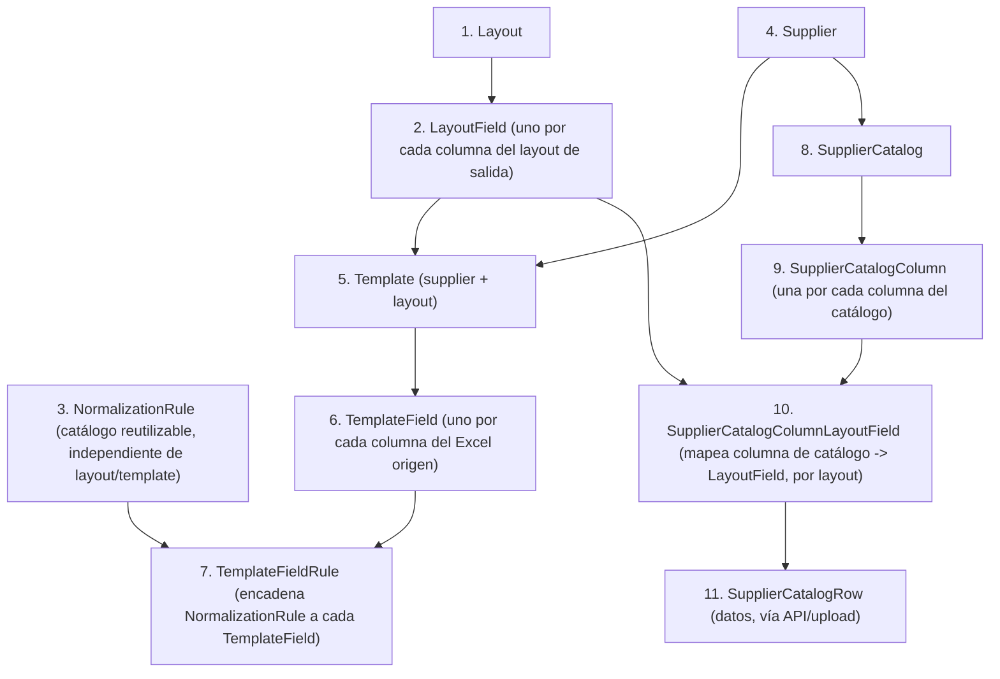

# Configuración de contenido: Layouts, Templates y Catálogos

A diferencia de [`extraction-flow.md`](extraction-flow.md), que documenta el procesamiento de facturas, este documento describe **cómo se da de alta la configuración** que ese procesamiento necesita: layouts, reglas de normalización, templates y catálogos.

## Qué se administra desde el admin de Django y qué desde la API

| Modelo | Se crea desde |
|---|---|
| `Layout`, `LayoutField` | Admin de Django |
| `NormalizationRule` | Admin de Django |
| `Supplier` | Admin de Django |
| `Template`, `TemplateField`, `TemplateFieldRule` | Admin de Django |
| `SupplierCatalog`, `SupplierCatalogColumn`, `SupplierCatalogColumnLayoutField` | Admin de Django |
| `SupplierCatalogRow` (los **datos** del catálogo) | API — `SupplierCatalogRowViewSet` (CRUD individual + carga masiva) |

!!! info "Por qué la data de catálogo sí tiene API y el resto no"
    Todo lo anterior es **configuración**: se define una vez por proveedor/layout y cambia poco. `SupplierCatalogRow` es **data**: el contenido del catálogo de un proveedor (fracciones, descripciones, etc.) se actualiza con frecuencia y en volumen (cientos/miles de filas), por eso tiene endpoints propios en vez de capturarse a mano en el admin.

---

## Orden de alta (dependencias)

Como cada modelo depende del anterior, seguir este orden evita errores de referencias faltantes:

---

## Layouts

### `Layout`

| Campo | Convención |
|---|---|
| `code` | `snake_case`, siempre en minúsculas. |
| `name` | Libre, pero se recomienda con mayúscula inicial en cada palabra (ej. `Casa Azul`). |

### `LayoutField`

| Campo | Convención |
|---|---|
| `layout` | El layout al que pertenece este campo. |
| `name` | **Sin convención fija** — debe escribirse exactamente como se espera que aparezca en el archivo de salida final. Depende de lo que necesite el usuario/proceso destino, no de una regla del sistema. |
| `sort_order` | Define el orden en que aparecen las columnas en el Excel de salida. |

!!! warning "Cuida el `sort_order` al agregar campos"
    `sort_order` es único por `Layout` (`unique_sort_order_per_layout`). Si al agregar un nuevo `LayoutField` reutilizas un `sort_order` ya usado en ese layout, el admin rechazará el registro con un error de "ya existe uno con ese sort_order". Antes de dar de alta un campo nuevo, revisa el último `sort_order` usado en ese layout, o deja huecos (10, 20, 30...) al planear el layout para poder insertar campos después sin reordenar todo.

---

## Reglas de normalización

### `NormalizationRule`

Es un catálogo **reutilizable**, independiente de layout o template — la misma regla puede encadenarse a `TemplateField`s distintos vía `TemplateFieldRule`.

| Campo | Convención |
|---|---|
| `name` | Muy descriptivo y en español, indicando el cambio concreto que hace. Ejemplo: `Fecha YYYYMMDD a dd/mm/yyyy`. |
| `rule_type` | Elegir uno de los tipos disponibles: `date_format`, `value_map`, `regex_replace`, `trim`, `uppercase`. |
| `description` | Muy descriptiva: qué hace, **qué espera recibir** y **qué entrega**. Esta descripción es la única documentación que verá quien configure un `TemplateFieldRule` después, así que debe bastar para decidir si aplica sin tener que leer el código. |
| `config` | Ver la tabla de formas esperadas por `rule_type` en [`data-model.md`](data-model.md#normalizationrule) y el detalle de `value_map` extendido (con `lookup`) en [`extraction-flow.md`](extraction-flow.md#value_map-extendido). |

!!! tip "Ejemplo de buena `description`"
    Para una regla `value_map` con `lookup` hacia `Currency`:

    > "Convierte el código de moneda tal como viene en la factura (ej. `DLS`, `PES`) al `code` interno de `Currency`. Recibe texto libre; si no hay match en `map` ni `lookup`, entrega el valor original sin cambios."

---

## Templates

### `Template`

| Campo | Convención |
|---|---|
| `supplier` | Obligatorio siempre — el proveedor al que pertenece el template. |
| `layout` | El layout destino de este template. |
| `name` | `snake_case`, minúsculas, con el patrón **`supplier_layout_tipo`**. Ejemplo: `suzuki_casaazul_xlsx`. |
| `document_type` | Elegir entre `xml` / `xlsx`. |

Recuerda que `(supplier, layout, document_type)` es único entre templates activos (`unique_active_template_per_supplier_layout_format`) — no puede haber dos templates activos para la misma combinación proveedor/layout/formato.

### `TemplateField`

| Campo | Convención |
|---|---|
| `layout_field` | El campo destino — sencillo, se elige de una lista. |
| `source_field` | Debe ser **exacto** a como viene en el Excel de origen (nombre de encabezado literal) o el XPath, según `extraction_type`. |
| `extraction_type`, `worksheet`, `header_occurrence` | Sin convención adicional — ver [`data-model.md`](data-model.md#templatefield) para su significado. |

!!! danger "`source_field` exacto, incluyendo espacios y mayúsculas"
    La extracción por `header_name` busca coincidencia exacta de string contra el encabezado del Excel (ver `_iter_data_rows` en `extraction-flow.md`). Un espacio de más, un acento faltante o una mayúscula distinta hacen que el campo simplemente no se encuentre — y no genera error, la celda queda vacía.

### `TemplateFieldRule`

No tiene convención de captura: es literal solo **relacionar** un `TemplateField` con una `NormalizationRule` existente y darle un `sort_order` para definir el orden de la cadena.

---

## Catálogos

### `SupplierCatalog`

| Campo | Convención |
|---|---|
| `name` | Sin convención estricta, pero debe ser muy descriptivo. Ejemplo: `Catálogo Suzuki`. |
| `pivot_field_name` | Debe ser **exacto** a como viene la columna pivote en el archivo del catálogo (mismo criterio que `source_field` en `TemplateField`). |

### `SupplierCatalogColumn` y `SupplierCatalogColumnLayoutField`

Sin convenciones adicionales a las ya documentadas en [`data-model.md`](data-model.md#app-catalogs) — `source_name` exacto al encabezado del archivo de catálogo, y el mapping a `LayoutField` se define una vez por cada layout que necesite ese dato.

### `SupplierCatalogRow` (datos) — vía API

A diferencia de todo lo anterior, la **data** del catálogo no se captura en el admin: se sube por archivo.

#### `SupplierCatalogRowViewSet`

CRUD estándar de DRF sobre filas individuales, más una acción de reemplazo masivo.

| Endpoint | Método | Descripción |
|---|---|---|
| `/catalog-rows/` | `GET` | Lista filas. Filtrable por `?supplier_catalog=<id>`. |
| `/catalog-rows/` | `POST` | Crea una fila individual. |
| `/catalog-rows/{id}/` | `GET` / `PUT` / `PATCH` / `DELETE` | CRUD de una fila puntual. |
| `/catalog-rows/upload/` | `POST` | **Reemplazo completo** de las filas de un catálogo desde un Excel. |

**`upload` — request** (`multipart/form-data`):

| Campo | Descripción |
|---|---|
| `supplier_catalog` | PK del `SupplierCatalog` a reemplazar. |
| `file` | Excel cuyos encabezados deben incluir `pivot_field_name` **y** el `source_name` de cada `SupplierCatalogColumn` configurada para ese catálogo. |

**Validaciones, en orden:**

1. El archivo debe poder leerse con `pandas.read_excel` → si falla, `400` con `code=VALIDATION_ERROR`.
2. Se descartan filas completamente vacías (`dropna(how="all")`).
3. Deben estar presentes todas las columnas esperadas (`pivot_field_name` + columnas configuradas) → si falta alguna, `400` listando cuáles.
4. Se descartan filas con el valor pivote vacío.
5. No puede haber valores de pivote duplicados dentro del archivo → si hay, `400` listando hasta 10 valores duplicados.

**Comportamiento de escritura:** dentro de una transacción atómica, se **borran todas** las `SupplierCatalogRow` existentes de ese catálogo y se insertan las nuevas con `bulk_create`. No es un upsert — es reemplazo total.

**Response de éxito:** `201 Created`, `{"created": <n>}`.

!!! warning "El `upload` es destructivo"
    Cada llamada a `upload` **borra por completo** las filas previas del catálogo antes de insertar las nuevas, incluso si el archivo nuevo trae menos filas que las que ya existían. Si el archivo a subir es un extracto parcial del catálogo (no el catálogo completo), esta acción va a eliminar las filas que no vengan en ese archivo.

#### `ExcelDeduplicateView`

Utilidad para **limpiar un archivo antes de subirlo** — no toca la base de datos, solo procesa el archivo y lo devuelve.

`POST /catalog-rows/deduplicate-excel/` (`multipart/form-data`), mismo request que `upload`: `supplier_catalog` + `file`.

Quita renglones vacíos y duplicados usando el `pivot_field_name` ya configurado en ese `SupplierCatalog` — el usuario no tiene que escribir/adivinar cuál es la columna pivote.

| Caso | Status | Cuerpo |
|---|---|---|
| El archivo no se puede leer | `400` | `{"code": VALIDATION_ERROR, "detail": "No se pudo leer el archivo: ..."}` |
| El archivo no trae la columna pivote configurada | `400` | `{"code": VALIDATION_ERROR, "detail": "...", }` con las columnas disponibles listadas |
| Éxito | `200` | Archivo `.xlsx` (`archivo_sin_duplicados.xlsx`) como adjunto, con header `X-Duplicates-Removed: <n>` indicando cuántas filas duplicadas se quitaron. |

Al deduplicar conserva la **primera** ocurrencia de cada valor pivote (`drop_duplicates(subset=[pivot_col], keep="first")`).

!!! tip "Flujo recomendado para actualizar un catálogo"
    1. `POST /catalog-rows/deduplicate-excel/` con el archivo crudo del proveedor → descargar el archivo limpio.
    2. Revisar manualmente el header `X-Duplicates-Removed` para confirmar que la cantidad de duplicados removidos tiene sentido.
    3. `POST /catalog-rows/upload/` con el archivo ya limpio, para reemplazar el catálogo.

---

